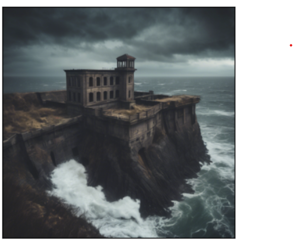
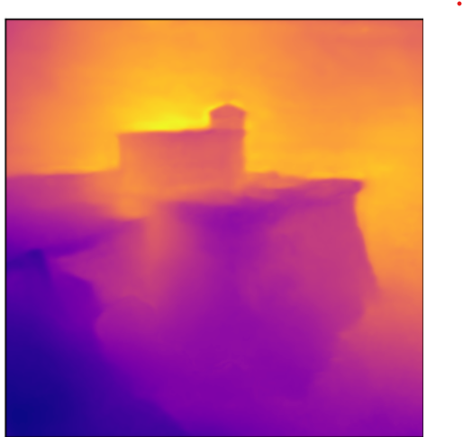
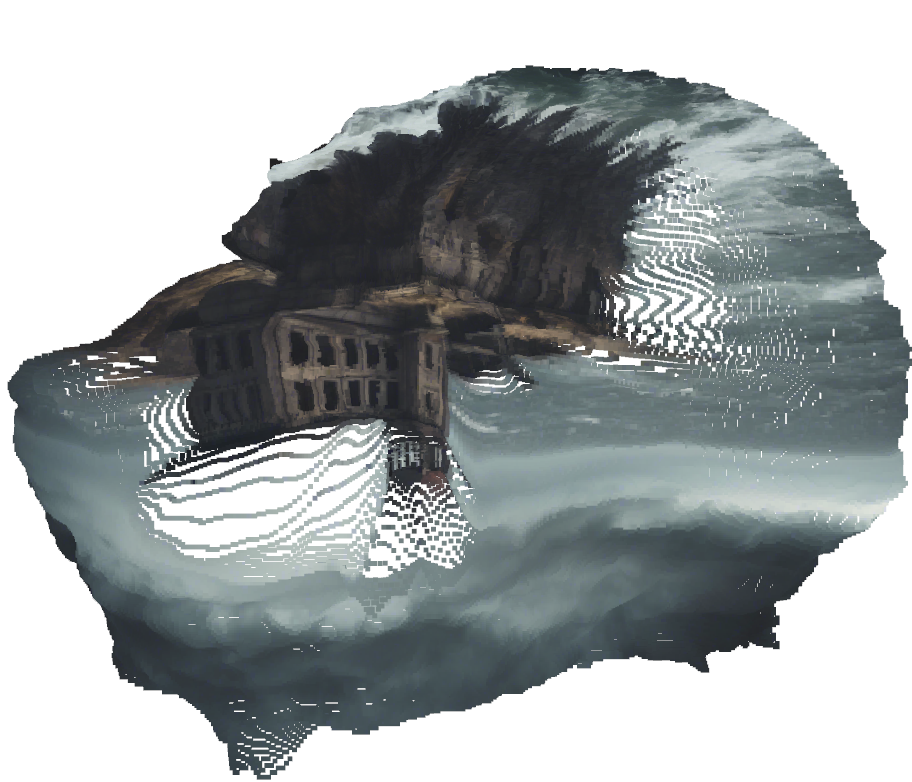
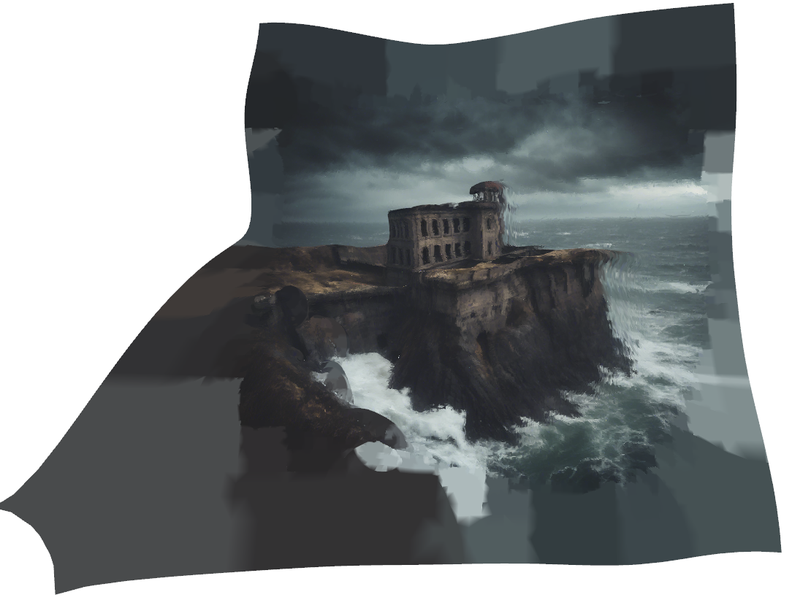

# 🔍 3D Mesh Generation from a Single Image using GLPN and Open3D

This project demonstrates a simple and effective way to turn a single 2D image into a 3D mesh. It combines a deep learning-based depth estimation model with 3D reconstruction tools to generate a realistic 3D structure, which can be useful in game development or other interactive applications.

---

## 🧠 What This Project Does

- Takes a single RGB image as input
- Predicts its depth using a machine learning model (GLPN)
- Converts the RGB + depth into a point cloud
- Reconstructs a 3D mesh from the point cloud using Open3D
- Exports the final 3D model in `.obj` format

This project is a good starting point for understanding how to go from 2D to 3D using open-source tools and pre-trained models.

---

## 🧰 Tools & Libraries Used

- **GLPN (from Hugging Face)** for depth estimation
- **Open3D** for point cloud and mesh generation
- **Matplotlib / OpenCV** for visualization and preprocessing
- **PyTorch** as the ML framework

---

## 📷 Input Example

- Input image: `CLIF_IMAGE_AI.png`
- Depth map is predicted from this image
- A 3D `.obj` file is generated as output

---

## 🖼️ Output Screenshots

| Input Image | Predicted Depth |
|-------------|------------------|
|  |  |

| Point Cloud | Reconstructed Mesh |
|-------------|--------------------|
|  |  |

---

## 🚀 How to Run

### Step 1: Install Requirements

```bash
pip install -r requirements.txt
